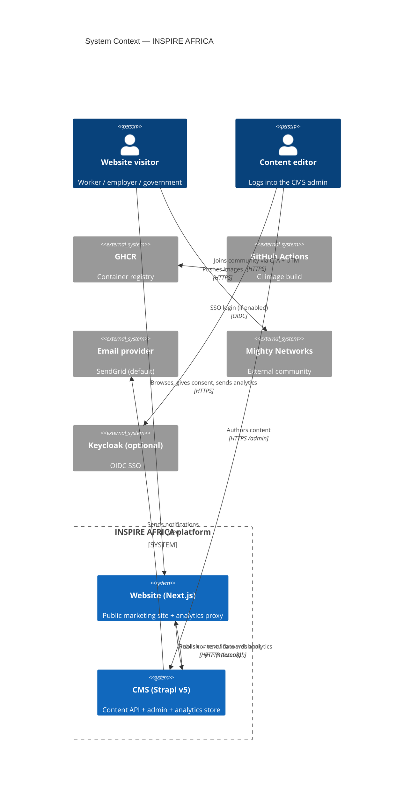
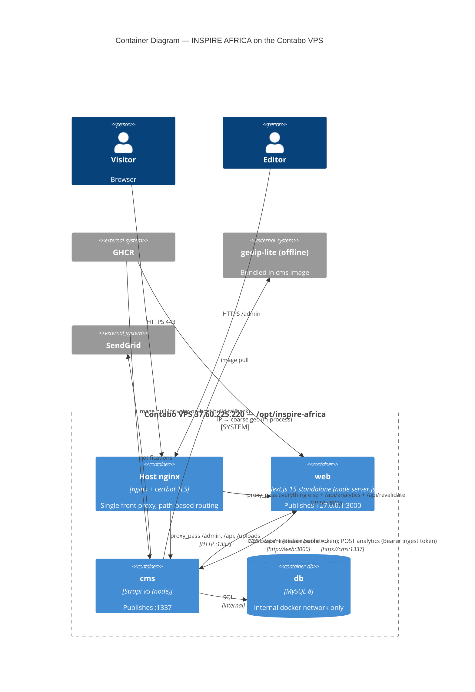

# System Architecture

> Purpose: the canonical end-to-end picture of how the INSPIRE AFRICA platform fits together — web, CMS, database, proxy, registry, CI, browser, and third-party providers — with responsibilities and trust boundaries.
> Last reviewed: 2026-05-27 (commit 49a621a)

## Table of contents
- [1. Overview](#1-overview)
- [2. Components & responsibilities](#2-components--responsibilities)
- [3. C4 — System context](#3-c4--system-context)
- [4. C4 — Container diagram](#4-c4--container-diagram)
- [5. Trust boundaries](#5-trust-boundaries)
- [6. Request paths (high level)](#6-request-paths-high-level)
- [7. Repository ↔ runtime mapping](#7-repository--runtime-mapping)

---

## 1. Overview

INSPIRE AFRICA is a two-application platform:

| App | Repo | Tech | Role |
|-----|------|------|------|
| **Website** | `Bahindiemma/inspire-africa-website` (this repo) | Next.js 15.5 App Router, React 19, TypeScript, Tailwind v4 | Public marketing site + analytics ingest proxy + revalidation webhook target |
| **CMS** | `Bahindiemma/inspire-africa-cms` | Strapi v5.46.1, MySQL 8 | Headless content API, content authoring, analytics storage, RBAC |

Both run as Docker containers on a single Contabo VPS (`37.60.225.220`, domain `inspireafricans.com`), fronted by **host nginx** (TLS via certbot). Images are built by GitHub Actions and published to GHCR.

Verified anchors:
- Website stack: `package.json`, `next.config.mjs`, `app/globals.css` (Tailwind v4 `@import "tailwindcss"` + `@theme`).
- CMS stack: `/tmp/cms-edit/package.json` (`@strapi/strapi` 5.46.1, `mysql2`, `geoip-lite`, `ua-parser-js`, `openid-client`).
- Compose topology: `deploy/docker-compose.yml` (NOTE: this repo file declares `web` on host port 80 and a bare-IP `CMS_PUBLIC_URL`; the live server instead fronts both with host nginx — see [Deployment runbook](./12-deployment-runbook.md) for the drift).

## 2. Components & responsibilities

| Component | Responsibility | Notes / source |
|-----------|----------------|----------------|
| **Browser** | Renders the site; runs the consent-gated first-party analytics tracker | `lib/analytics/tracker.ts`, `components/consent/*` |
| **Host nginx** | Single front proxy; terminates TLS; routes `/api/analytics` + `/api/revalidate` → `web:3000`, Strapi paths (`/admin`, `/api/*`, `/uploads`) → `cms:1337`, everything else → `web` | `TODO/UNVERIFIED`: nginx vhost config lives on the server, not in either repo. Document the routing intent; capture the real config during handover. |
| **web (Next.js)** | SSR/ISR marketing pages; server-side fetches from CMS; analytics proxy; revalidate webhook receiver | `app/`, `lib/`, `Dockerfile` |
| **cms (Strapi)** | Content REST API (public read token), admin panel, analytics ingest/storage, RBAC, revalidation webhook sender, nightly cron | `/tmp/cms-edit/src/`, `/tmp/cms-edit/config/` |
| **db (MySQL 8)** | Persistent store for all CMS content + analytics | `deploy/docker-compose.yml` `db` service |
| **GHCR** | Container registry. `website` package is PUBLIC; `cms` package is PRIVATE | `.github/workflows/docker-publish.yml` |
| **GitHub Actions** | Build + push images on push to `main` | both repos' `docker-publish.yml` |
| **geoip-lite (offline MaxMind GeoLite2)** | Coarse country/region/city from the visitor IP, in-process, no external call | `/tmp/cms-edit/src/utils/analytics/geo.ts` |
| **Email provider (SendGrid default)** | Transactional/notification email; form-notify target | `/tmp/cms-edit/config/plugins.ts`, `.env.example` |
| **Upload provider (local / AWS S3 / Cloudinary)** | Media storage. Production compose uses `local` volume `cms_uploads` | `/tmp/cms-edit/config/plugins.ts`, `deploy/docker-compose.yml` |
| **Keycloak (optional, OIDC)** | SSO for CMS users, role mapping → Strapi roles. Disabled by default (`KEYCLOAK_ENABLED=false`) | `/tmp/cms-edit/src/extensions/users-permissions/strategies/keycloak.ts` |
| **Mighty Networks** | External community ("Join the Community" CTAs link out with UTM params) | `lib/site.ts` `community.baseUrl`, `lib/utm.ts` |

## 3. C4 — System context

## 4. C4 — Container diagram

## 5. Trust boundaries

1. **Internet → nginx**: TLS terminates here. nginx is the only externally listening surface (ports 80/443; CMS `:1337` may also be exposed per the repo compose, but on the production host the intent is nginx-fronted — confirm during handover).
2. **nginx → web/cms**: plaintext HTTP over the host loopback / docker network. Internal, not internet-reachable.
3. **web → cms**: server-to-server over the docker `internal` network (`http://cms:1337`). Carries the **public read token** (content) and the **analytics ingest token** (analytics). Neither token is ever exposed to the browser.
4. **Browser → web `/api/analytics`**: same-origin only (enforced in `app/api/analytics/route.ts`). The browser never holds the ingest token.
5. **cms → web `/api/revalidate`**: authenticated by `REVALIDATE_SECRET` query param.
6. **cms → db**: credentials in `DATABASE_*` env. DB has no host port (internal only) per `deploy/docker-compose.yml`.
7. **PII boundary**: `candidate` and `form-submission` collections are admin-only on the content API (public role can only `form-submission.create`). Analytics never stores raw IP — only a salted, truncated hash.

## 6. Request paths (high level)

- **Page view**: browser → nginx → web (ISR, may fetch cms) → HTML. See [Content flow](./09-content-flow-and-editing.md) sequence diagram.
- **Analytics**: browser tracker → web `/api/analytics` (same-origin) → cms `/api/analytics/collect` (Bearer ingest token, X-Forwarded-For) → MySQL. See [Frontend/analytics guide](./05-frontend-analytics-guide.md).
- **Publish**: editor publishes in cms admin → cms lifecycle → web `/api/revalidate?secret=…` → `revalidateTag`/`revalidatePath`.
- **Deploy**: push to `main` → Actions → GHCR → server `docker compose pull && up -d`.

## 7. Repository ↔ runtime mapping

| Runtime container | Built from | Image |
|-------------------|------------|-------|
| `web` | this repo `Dockerfile` (`output: 'standalone'`) | `ghcr.io/bahindiemma/inspire-africa-website:latest` (PUBLIC) |
| `cms` | CMS repo `Dockerfile` (3-stage Strapi build) | `ghcr.io/bahindiemma/inspire-africa-cms:latest` (PRIVATE) |
| `db` | official image | `mysql:8.0` |

See [Known issues](./15-known-issues-tech-debt.md) for the repo-compose vs. live-server drift and the private-GHCR build workaround.
