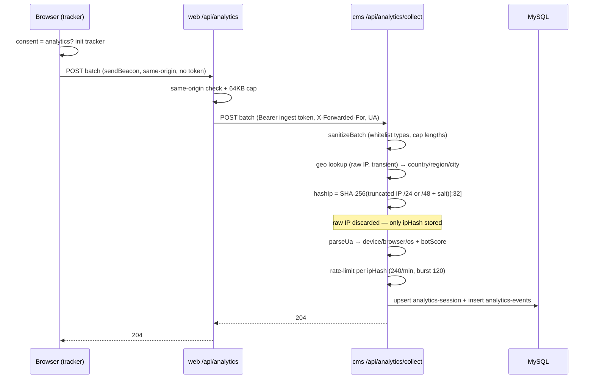

# Frontend / Analytics Guide

> Purpose: how consent, the first-party analytics tracker, the server ingest proxy, and the revalidation webhook work on the frontend.
> Last reviewed: 2026-05-27 (commit 49a621a)

## Table of contents
- [1. Consent model](#1-consent-model)
- [2. The tracker](#2-the-tracker)
- [3. Events](#3-events)
- [4. The ingest proxy](#4-the-ingest-proxy)
- [5. End-to-end sequence](#5-end-to-end-sequence)
- [6. The revalidate webhook](#6-the-revalidate-webhook)
- [7. Adding tracking to UI](#7-adding-tracking-to-ui)

---

## 1. Consent model

Source: `lib/consent.ts`, `components/consent/{ConsentProvider,CookieConsent,CookieSettingsLink}.tsx`.

- A single strictly-necessary first-party cookie `ia_consent` stores the decision. **Nothing else is set until the visitor opts in.**
- Cookie value: JSON `{ v, analytics, marketing, ts }`. `CONSENT_VERSION = 1`; a version bump invalidates older decisions and re-prompts. `Max-Age = 180 days`, `SameSite=Lax`, `Secure` on HTTPS.
- **Consent levels** (`ConsentLevel`): `necessary` (no record / rejected) → `analytics` (analytics only) → `all` (analytics + marketing).
- **GPC / DNT honoured**: `hasRejectSignal()` checks `navigator.globalPrivacyControl` and `doNotTrack`. If set and there's no explicit choice, `ConsentProvider` treats the visitor as rejected **without** showing a banner (not persisted, so they can still opt in via Cookie settings).
- The banner only appears when there is no stored decision and no reject signal.
- `withdraw()` clears the cookie and re-opens the banner.

## 2. The tracker

Source: `lib/analytics/tracker.ts` (pure browser module) driven by `components/analytics/AnalyticsTracker.tsx`.

- Mounts in the root layout but **does nothing until analytics consent is granted**. On withdrawal (level → `necessary`) it tears down and clears the session.
- **Session**: id in `sessionStorage` (`ia_sid` + `ia_sid_ts`); 30-minute inactivity timeout regenerates it.
- **Batching**: events queue and flush every 10s, on `MAX_QUEUE=50`, on `visibilitychange→hidden`, on `pagehide`, and on form submit. Flush prefers `navigator.sendBeacon`, falling back to `fetch(..., {keepalive:true})`. Failures are swallowed — analytics never throws into the app.
- **Route changes**: `AnalyticsTracker` fires `routeChanged` on every App Router navigation → flushes the previous page's events and enqueues a new `pageview`.
- **UTM + referrer**: captured once at init from the URL (`utm_source/medium/campaign`) and `document.referrer`, sent in `context`.

Payload shape sent to `/api/analytics`:
```json
{
  "sessionId": "uuid",
  "consentLevel": "analytics|all",
  "context": { "path": "/x", "title": "…", "referrer": "…", "utm": { "source": null, "medium": null, "campaign": null } },
  "events": [ { "type": "pageview", "path": "/x", "pageTitle": "…", "occurredAt": "ISO", "...": "..." } ]
}
```

## 3. Events

Event types (`EventType` in `tracker.ts`; whitelisted server-side in `validate.ts`):

| Type | Trigger |
|------|---------|
| `pageview` | Route change / first load |
| `section_view` | `[data-section]` or `section[id]` enters viewport (IntersectionObserver, threshold 0.4) |
| `scroll_depth` | Crossing 25/50/75/100% (once each per page) |
| `click` | Click on a `[data-track]` element (sends the track label + `data-*` meta) |
| `outbound_click` | Click on an `<a>` to a different origin (sends host + path) |
| `form_start` | First focus into a `<form>` |
| `form_submit` | Form submit (also forces a flush) |
| `session_end` | On teardown / consent withdrawal |

## 4. The ingest proxy

Source: `app/api/analytics/route.ts` (`runtime = nodejs`, `dynamic = force-dynamic`).

- **Same-origin guard**: if `Origin` and `Host` are present and disagree → `403`.
- **Body cap**: `MAX_BODY_BYTES = 64 KB`; oversize/empty → `204` no-op.
- **No-op when unconfigured**: if `ANALYTICS_INGEST_URL` or `ANALYTICS_INGEST_TOKEN` missing → `204`.
- Forwards the raw body to the CMS with `Authorization: Bearer ${ANALYTICS_INGEST_TOKEN}`, the visitor's `X-Forwarded-For` (so the CMS can geo-locate then discard), and the UA. 4s timeout. **Always returns `204`** regardless of CMS outcome — analytics must never surface errors to visitors. The browser never sees the ingest token.

## 5. End-to-end sequence



IP anonymisation detail (`utils/analytics/ip.ts`): IPv4 → last octet zeroed (/24); IPv6 → first three hextets kept (/48); then salted SHA-256 truncated to 32 hex chars. The raw IP is used only transiently for the geo lookup (`utils/analytics/geo.ts`, offline `geoip-lite`) and never stored.

## 6. The revalidate webhook

Source: `app/api/revalidate/route.ts`; sender: CMS `src/middlewares/revalidate-frontend.ts`.

- CMS fires `POST ${FRONTEND_REVALIDATE_URL}?secret=${REVALIDATE_SECRET}` on `afterCreate/afterUpdate/afterDelete` of revalidatable collections (page, blog-post, legal-document, job-posting, corridor, site-setting, design-token, navigation, form-definition).
- The Next.js handler verifies the secret (`403` otherwise), then:
  - `revalidateTag(collection)` and `revalidateTag(`${collection}:${slug}`)` — precise.
  - `revalidatePath(...)` per collection — broad (e.g. `blog-post` → `/` + `/blog/<slug>`; `page` → `/` or `/<slug>`; `site-setting`/`design-token`/`navigation`/`corridor`/`form-definition` → `revalidatePath('/', 'layout')`; `legal-document` → `/<slug>`).
- Returns `{ revalidated: true, collection, slug }`.

## 7. Adding tracking to UI

- **Click tracking**: add `data-track="my-label"` (and any `data-*` for meta) to the element.
- **Section visibility**: give the element `data-section="my-section"` or use a `section[id]`.
- **Outbound links** are tracked automatically.
- Do not call the tracker directly from components; the global listeners (capture-phase click/focusin/submit + IntersectionObserver) pick these up. Keep new sections semantically marked so they're observable.
