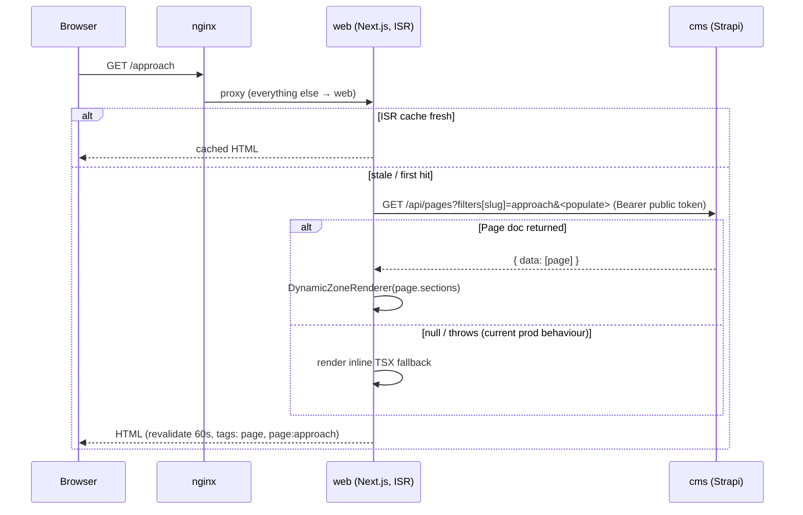
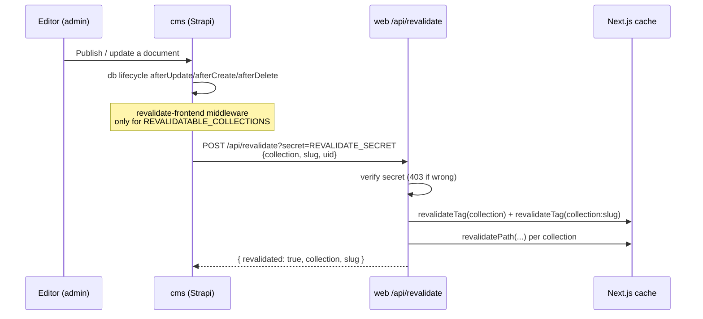

# Content Flow & Editing Guide

> Purpose: how content moves from the CMS to the site, how seeding works, and how to safely edit copy TODAY given the rendering fallback.
> Last reviewed: 2026-05-27 (commit 49a621a)

## Table of contents
- [1. Static vs CMS pages](#1-static-vs-cms-pages)
- [2. Visitor page request (ISR)](#2-visitor-page-request-isr)
- [3. Seeding (seed-content.ts + RESEED_CONTENT)](#3-seeding-seed-contentts--reseed_content)
- [4. Publish → revalidate](#4-publish--revalidate)
- [5. How to edit copy safely today](#5-how-to-edit-copy-safely-today)
- [6. Forms](#6-forms)

---

## 1. Static vs CMS pages

| Route | Rendering | Source |
|-------|-----------|--------|
| `/` (home) | Static TSX; reads live CMS for corridors + 3 blog posts | `app/page.tsx`, `getCorridors`, `getBlogPosts` |
| `/blog/[slug]` | CMS-driven (with static fallback) | `app/blog/[slug]/page.tsx`, `getBlogPost` |
| `/approach`, `/employers`, `/governments`, `/join`, `/workers` | `getPage(slug)` → `DynamicZoneRenderer` if a Page doc returns, else inline TSX fallback | `app/<route>/page.tsx`, `lib/cms/pages.ts` |
| `/privacy`, `/cookies`, `/terms`, `/modern-slavery` | Static TSX body; CMS supplies metadata only (version/lastUpdated/lede/controller) | `lib/cms/legal.ts` |
| `/contact` | Static TSX | `app/contact/page.tsx` |

**Current reality:** the five sub-pages render the **TSX fallback** in production, because `getPage()`'s fully-populated Strapi v5 query returns null/throws (the `populate[sections][on][...]` fragment in `lib/cms/pages.ts` needs fixing). The Page documents exist in the CMS (seeded) but aren't displayed. See ADR-007 and [Known issues](./15-known-issues-tech-debt.md).

## 2. Visitor page request (ISR)

## 3. Seeding (seed-content.ts + RESEED_CONTENT)

Source: `inspire-africa-cms/src/bootstrap/seed-content.ts`, run from `src/index.ts` `bootstrap()`.

- **Idempotent**: upserts on a stable key (slug / formKey / country). Re-running patches, never duplicates.
- **Skips on production boots**: exits early if a Site Settings document exists, **unless** `RESEED_CONTENT=true`.
- **What it seeds**: Site Settings, Design Tokens, Navigation, 6 Corridors, an Editorial Desk author, 11 tags, 3 blog posts (abbreviated bodies), 3 form definitions, 4 legal-document stubs, a Home Page, and Pages for workers/employers/governments/approach/join (full Dynamic Zones mirroring the TSX).
- **Force a re-seed**: stop Strapi, set `RESEED_CONTENT=true`, restart. **Wipe & start over**: delete `.tmp/data.db` (dev SQLite) or truncate the relevant tables (prod MySQL).

## 4. Publish → revalidate

Revalidatable collections (CMS `revalidate-frontend.ts`): page, blog-post, legal-document, job-posting, corridor, site-setting, design-token, navigation, form-definition. The webhook is configured in Strapi admin → Settings → Webhooks (or via `FRONTEND_REVALIDATE_URL`). If `FRONTEND_REVALIDATE_URL`/`REVALIDATE_SECRET` are unset, the CMS logs and skips.

## 5. How to edit copy safely today

Because the sub-pages render the TSX fallback (not the CMS), there are two distinct edit surfaces. Pick the one that actually drives what visitors see:

| To change… | Edit here (effective today) | CMS edit (effective once ADR-007 is fixed) |
|------------|-----------------------------|--------------------------------------------|
| Home corridors marquee | CMS Corridor docs (home reads them live) | same |
| Home blog/insights | CMS Blog Posts (home reads them live) | same |
| Approach/Employers/Governments/Join/Workers body copy | the inline TSX in `app/<route>/page.tsx` (fallback that renders) | CMS Page Dynamic Zone |
| Legal page version/date/lede/controller | CMS Legal Document metadata (the site reads it) | same |
| Legal page body text | the TSX in `app/<route>/page.tsx` | stays in TSX by design |
| Site name/contact/social/community URL | CMS Site Settings (layout + footer read it) OR `lib/site.ts` fallback | same |
| Nav links | CMS Navigation OR `lib/site.ts NAV_LINKS` fallback | same |

Practical guidance:
1. For the sub-pages, **edit the TSX fallback** and ship a code deploy — that is what visitors see right now. Mirror the same change in the CMS Page so you're ready when rendering switches.
2. For home + legal + settings + nav + blog, **edit in the CMS**; the publish webhook revalidates within seconds.
3. After any CMS change, confirm the revalidate webhook fired (CMS logs `[revalidate-frontend] notified …`). If content looks stale, see [Runbooks](./13-runbooks-incident-playbooks.md) → "stale content".

## 6. Forms

The website forms (`components/forms/{ContactForm,EmployersForm,GovernmentsForm}.tsx`) are **client stubs**: on submit they `e.preventDefault()` and show an `alert()` mentioning Wix Forms. They do **not** POST to the CMS `form-submission` endpoint (which exists and accepts public POSTs). To make forms functional, wire them to `POST ${STRAPI}/api/form-submissions` (or the intended Wix Forms widget). Tracked in [Known issues](./15-known-issues-tech-debt.md).
