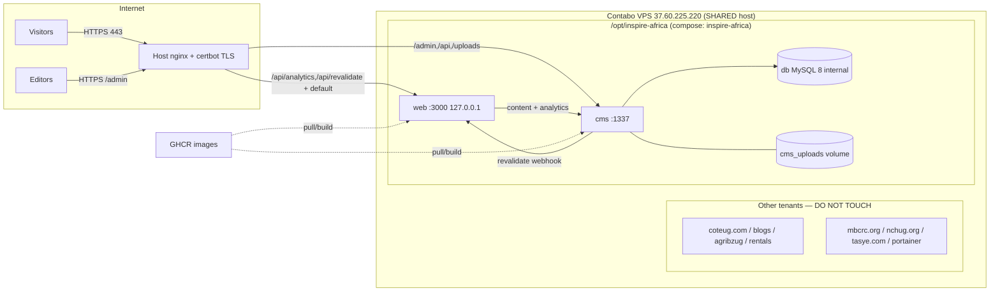

# Deployment Runbook

> Purpose: deploy and operate the platform on the shared Contabo VPS — compose topology, nginx routing, the Caddy→nginx history, normal deploys, the on-server CMS build fallback, SSL renewal, and shared-VPS guardrails.
> Last reviewed: 2026-05-27 (commit 49a621a)

## Table of contents
- [1. Topology](#1-topology)
- [2. Deployment diagram](#2-deployment-diagram)
- [3. SHARED-VPS guardrails (read first)](#3-shared-vps-guardrails-read-first)
- [4. Caddy → nginx history](#4-caddy--nginx-history)
- [5. Repo compose vs live drift](#5-repo-compose-vs-live-drift)
- [6. Normal deploy](#6-normal-deploy)
- [7. On-server CMS build fallback](#7-on-server-cms-build-fallback)
- [8. First boot / wiring](#8-first-boot--wiring)
- [9. SSL / certbot renewal](#9-ssl--certbot-renewal)
- [10. Log locations](#10-log-locations)

---

## 1. Topology

- Host: Contabo VPS `37.60.225.220`, SSH on **port 2021** with **2FA**.
- Stack dir: **`/opt/inspire-africa`** (compose project `inspire-africa`).
- Services (`deploy/docker-compose.yml`): `db` (MySQL 8, internal only), `cms` (Strapi, `:1337`), `web` (Next.js). A `caddy` service is **retired/commented out**.
- Domain: `inspireafricans.com` (apex + www → the VPS). CMS admin at `inspireafricans.com/admin`.
- Fronted by **host nginx** (TLS via certbot). `web` publishes on `127.0.0.1:3000`.

nginx routing (intent):
- `/api/analytics`, `/api/revalidate` → `web:3000`
- Strapi paths (`/admin`, `/api/*`, `/uploads`) → `cms:1337`
- everything else → `web`

`TODO/UNVERIFIED`: the nginx vhost config lives on the server, not in either repo — capture it during handover and store it (e.g. in this docs folder or a server-config repo).

## 2. Deployment diagram



## 3. SHARED-VPS guardrails (read first)

The VPS also runs unrelated production apps: **coteug.com, blogs.coteug.com, agribzug.com, rentals.coteug.com, mbcrc.org, nchug.org, tasye.com, portainer**.

- **NEVER** run global `docker system prune`, `docker compose down` outside the stack dir, or anything that touches other containers/volumes/networks.
- **ONLY** operate inside `/opt/inspire-africa` and scope all `docker compose` commands to that project (run them from that directory).
- Image cleanup: prefer `docker image prune -f` only after confirming it won't remove images other tenants need, or target by repo. When in doubt, skip the prune.
- Keep SSH (2021) and any host management ports open in the firewall.

## 4. Caddy → nginx history

An earlier design fronted the stack with a `caddy` container (per-stack reverse proxy + auto-TLS). On a shared host this collides with the host's existing TLS/routing for the other tenants. The decision (ADR-003) was to **retire Caddy** and use the **single host nginx** as the only front proxy, with certbot for TLS. The `caddy` service remains commented out in `deploy/docker-compose.yml` for history; do not re-enable it on the shared host.

## 5. Repo compose vs live drift

`deploy/docker-compose.yml` in this repo reflects an **earlier bare-IP / port-80 layout**, not the live nginx-fronted setup. Differences to expect on the server:
- Repo: `web` published on host `80:3000`; live: `web` on `127.0.0.1:3000` behind nginx.
- Repo `.env.production.example`: `SITE_URL=http://37.60.225.220`, `CMS_PUBLIC_URL=http://…:1337`, `CORS_ORIGINS` bare IP; live: HTTPS `inspireafricans.com` values.
- The live `/opt/inspire-africa/docker-compose.yml` and `.env` are the source of truth on the server. **Reconcile the repo file with the live file during handover** (tracked in [Known issues](./15-known-issues-tech-debt.md)).

## 6. Normal deploy

After CI is green (Actions tab), on the VPS:
```bash
# SSH: ssh -p 2021 root@37.60.225.220  (2FA)
cd /opt/inspire-africa
docker compose pull           # web pulls (public); cms pulls if PAT logged in
docker compose up -d
docker image prune -f         # see guardrails — be careful on a shared host
docker compose ps
```

## 7. On-server CMS build fallback

The `cms` GHCR package is PRIVATE. If `docker compose pull` can't fetch the CMS image (no GHCR login), build it on-host from the CMS repo checkout:
```bash
# Option A: log in to GHCR then pull
echo "<GHCR_PAT_with_read:packages>" | docker login ghcr.io -u Bahindiemma --password-stdin
docker compose pull cms

# Option B: build the CMS image on the host
cd /opt/inspire-africa-cms-src   # a checkout of inspire-africa-cms
docker build -t ghcr.io/bahindiemma/inspire-africa-cms:latest .
cd /opt/inspire-africa && docker compose up -d cms
```
The `web` image is PUBLIC and always pulls cleanly.

## 8. First boot / wiring

(From `deploy/README.md`.) On first boot:
1. `docker compose up -d`; watch `docker compose logs -f cms` for "Strapi is up" (first boot runs DB migrations + seeds).
2. Create the first admin at `/admin`.
3. Create a read-only API token (Settings → API Tokens) → set `STRAPI_PUBLIC_TOKEN` in `.env` → `docker compose up -d web`.
4. Configure the publish webhook: Strapi → Settings → Webhooks → URL `http://web:3000/api/revalidate?secret=<REVALIDATE_SECRET>`, events: entry publish/unpublish (CMS reaches `web` over the internal network).

## 9. SSL / certbot renewal

TLS is managed by **certbot on the host** (not in the stack). `TODO/UNVERIFIED`: exact certbot/nginx config is on the server.
- Renewal is normally automatic (`certbot.timer` / cron). Verify: `systemctl list-timers | grep certbot` and `certbot certificates`.
- Manual dry-run: `certbot renew --dry-run`. After a real renewal, reload nginx: `nginx -t && systemctl reload nginx`.
- If renewal fails, see [Runbooks](./13-runbooks-incident-playbooks.md) → "cert renewal failure".

## 10. Log locations

- Per-service: `docker compose logs cms` / `logs web` / `logs db` (from `/opt/inspire-africa`).
- nginx: host `/var/log/nginx/` (`TODO/UNVERIFIED` exact vhost log filenames).
- CMS app logs go to stdout (Strapi logger) → captured by `docker compose logs cms`.
- Analytics cron + revalidate webhook log lines are tagged `[analytics-cron]` / `[revalidate-frontend]` in the CMS logs.
